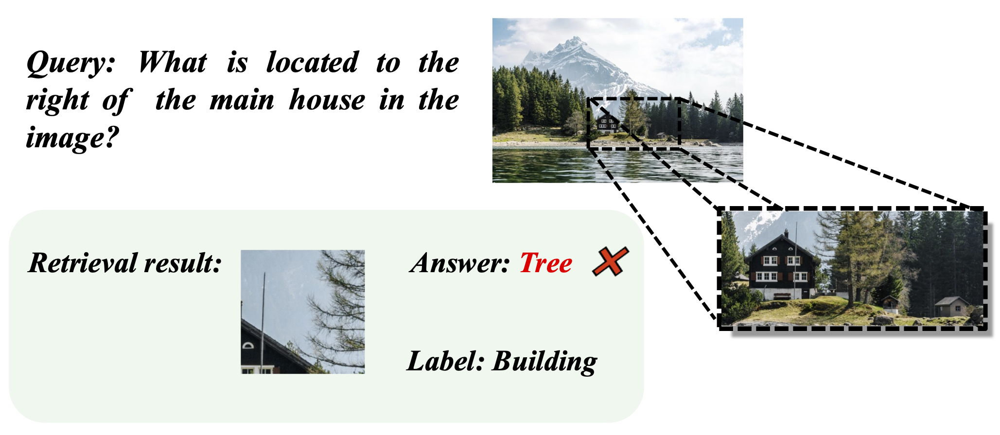

# The Failure Case of RAP

Although our RAP effectively retrieves key information from images, it struggles when the question lacks essential object details. As shown in the figure below, the question only mentions "house", so ***RAP*** retrieves only the image crop corresponding to the house, resulting in the loss of the image information of the building on the right.

